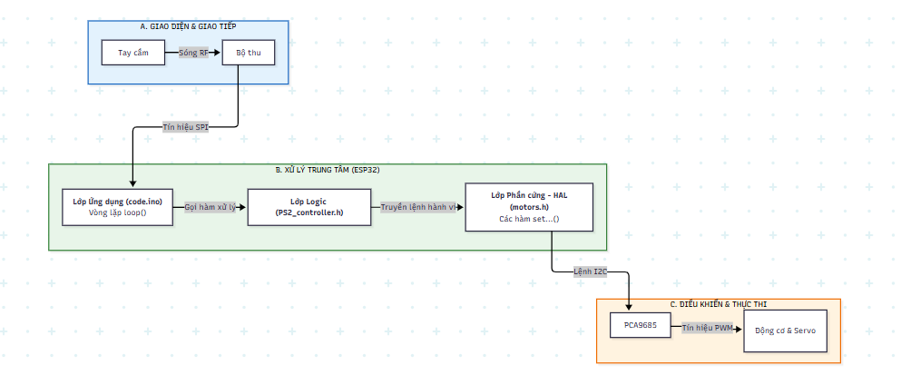
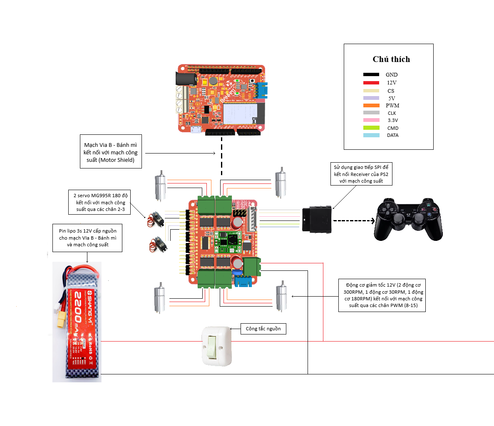

# 🐝 BumbleBee - FARC 2025 - Đội FU0501

Đây là mã nguồn chính thức cho Minibot của đội **BumbleBee** - **FU0501**, tham gia Vòng chung kết cuộc thi **FPTU AI & ROBOTICS CHALLENGE 2025 (FARC 2025)**.

## 📝 Giới thiệu

Minibot được thiết kế để thực hiện các nhiệm vụ trong cuộc thi FARC 2025. Robot được điều khiển không dây thông qua tay cầm PS2, có khả năng di chuyển linh hoạt, và được trang bị các cơ cấu chấp hành như tay gắp, thanh trượt tuyến tính để hoàn thành các yêu cầu của bài thi.

## 🖼️ Sơ đồ hệ thống

### Sơ đồ khối chức năng



### Sơ đồ mạch điện



## ⚙️ Phần cứng

Robot được xây dựng từ các thành phần chính sau:

| STT | Linh kiện | Chức năng |
| :-- | :--- | :--- |
| 1 | Vi điều khiển Via B - Bánh mì | Bộ não trung tâm, xử lý tín hiệu và điều khiển. |
| 2 | Mạch công suất cho Via B - Bánh mì | Điều khiển PWM cho động cơ DC và Servo. |
| 3 | Động cơ DC | Dùng cho hệ thống truyền động và các cơ cấu khác. |
| 4 | Động cơ Servo | Dùng cho cơ cấu gắp và thay đổi góc. |
| 5 | Tay cầm và bộ nhận tín hiệu PS2 | Giao diện điều khiển robot không dây. |
| 6 | Thanh trượt tuyến tính | Cơ cấu nâng hạ, tịnh tiến. |
| 7 | Nguồn điện (Pin Lipo) | Cung cấp năng lượng cho toàn bộ hệ thống. |

## 📚 Phần mềm & Thư viện

Chương trình được phát triển trên nền tảng **Arduino IDE**.

### Các thư viện cần thiết:

1.  **`PS2X_lib`**: Dùng để giao tiếp với tay cầm PS2. 
    *   Cài đặt: Tải từ [đây](https://github.com/makerviet/Arduino-PS2X-ESP32-Makerbot) hoặc cài đặt qua Library Manager của Arduino IDE.
2.  **`Adafruit_PWMServoDriver`**: Dùng để điều khiển mạch PCA9685.
    *   Cài đặt: Tải từ [đây](https://github.com/adafruit/Adafruit-PWM-Servo-Driver-Library) hoặc cài đặt qua Library Manager của Arduino IDE.
3.  **`Wire.h`**: Thư viện giao tiếp I2C (có sẵn trong Arduino IDE).

## 🔌 Sơ đồ kết nối (Pinout)

### Vi điều khiển Via B - Bánh mì ↔️ Linh kiện

| Linh kiện | Chân Via B | Ghi chú |
| :--- | :--- | :--- |
| **Mạch công suất** | | Kết nối qua shield mở rộng |
| **Tay cầm PS2** | `DAT` (GPIO 12) | Dữ liệu (MOSI) |
| | `CMD` (GPIO 13) | Lệnh (MISO) |
| | `SEL` (GPIO 15) | Chọn (SS) |
| | `CLK` (GPIO 14) | Xung nhịp (SCK) |

### Mạch công suất↔️ Động cơ & Servo

| Kênh PWM (PCA9685) | Cơ cấu | Chức năng |
| :--- | :--- | :--- |
| 8, 9, 10, 11 | 2 Động cơ DC | Di chuyển robot |
| 12, 13 | Động cơ DC | Thanh trượt tuyến tính chính |
| 14, 15 | Động cơ DC | Thanh trượt tuyến tính trên tay gắp |
| 2 | Servo 1 | Điều khiển góc (100°/180°) |
| 3 | Servo 2 | Đóng/Mở tay gắp |

## 🎮 Sơ đồ điều khiển (Tay cầm PS2)

| Nút | Chức năng |
| :--- | :--- |
| **Joysticks (Analog)** | Di chuyển robot. | 
| `SELECT` | Chuyển đổi giữa chế độ lái 1 tay (`SINGLE_HAND_DRIVING`) và 2 tay (`TWO_HAND_DRIVING`). | 
| `R1` | Đảo ngược chiều điều khiển của joystick. | 
| `R2` | Giữ để chạy ở tốc độ tối đa (`TOP_SPEED`). | 
| `L1` | Đưa Servo 1 (cơ cấu góc) về vị trí 100 độ. | 
| `L2` | Đưa Servo 1 (cơ cấu góc) về vị trí 180 độ. | 
| `Nút Tam giác` (GREEN) | Nâng thanh trượt tuyến tính chính. | 
| `Nút Chữ X` (BLUE) | Hạ thanh trượt tuyến tính chính. | 
| `D-Pad Lên` | Duỗi thanh trượt tuyến tính trên tay gắp. | 
| `D-Pad Xuống` | Co thanh trượt tuyến tính trên tay gắp. | 
| `D-Pad Trái` | Mở tay gắp (Servo 2). | 
| `D-Pad Phải` | Đóng tay gắp (Servo 2). | 
| `START` | Vô hiệu hóa cả 2 Servo (trạng thái an toàn). | 
| `L3` | Giữ để kích hoạt chế độ đặc biệt: Vừa di chuyển robot vừa nâng thanh trượt chính. |

## 🚀 Hướng dẫn cài đặt và sử dụng

1.  **Clone a Repository:**
    ```bash
    git clone https://github.com/doanhaa/FARC_BumbleBee.git
    ```
2.  **Cài đặt thư viện:** Mở Arduino IDE, vào `Sketch` -> `Include Library` -> `Manage Libraries...` và tìm kiếm, cài đặt các thư viện đã liệt kê ở trên.
3.  **Kết nối phần cứng:** Lắp ráp robot và kết nối các linh kiện theo sơ đồ.
4.  **Nạp code:**
    *   Mở file `code.ino` bằng Arduino IDE.
    *   Chọn đúng board (ví dụ: `ESP32 Dev Module`) và cổng COM.
    *   Nhấn nút `Upload`.
5.  **Kiểm tra:** Mở `Serial Monitor` với baudrate `115200` để xem các thông báo gỡ lỗi và trạng thái của robot.

## 👥 Tác giả

Mã nguồn được chỉnh sửa và phát triển bởi **Doanhaa** từ đội **BumbleBee FU0501**, dựa trên chương trình robot mẫu của ban tổ chức.

## Note
Bạn có thể sử dụng mã nguồn này để tham khảo, xin đừng đánh giá trình độ của tôi :(
